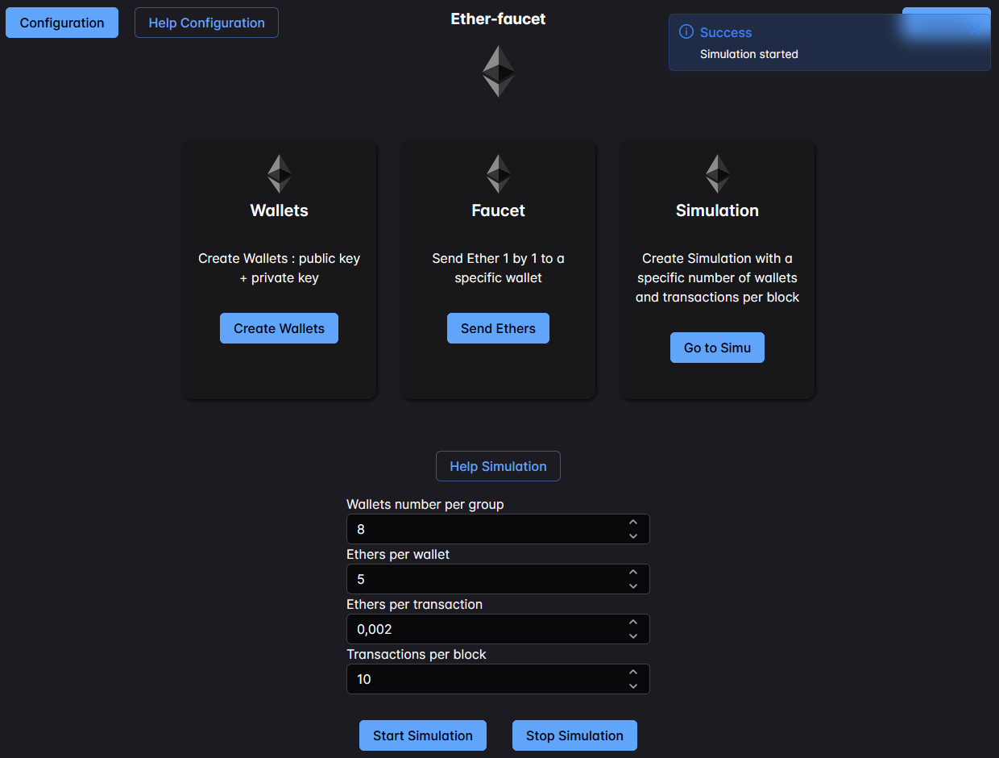

# ether-faucet


## Installation

### Prerequisites

Made on OS:
- Ubuntu: 22.04

Install:
- nodejs 20.11.1: https://nodejs.org/en
- Go 1.22.0 : https://go.dev/doc/install

Vscode extensions:
- Vue - Official

Browser extensions: 
- Vue Dev Tools: https://devtools.vuejs.org/guide/installation.html

**Clone the project**
```bash
git clone https://github.com/APlonks/ether-faucet.git
cd ether-faucet
```
### Start the project

**Frontend**
```bash
cd frontend
npm install
npm run dev # Dev mode
# or 
npm run build   # Prod mode with a nginx for example
```

**Backend**
```bash
cd backend
make dev # Dev mode
# or 
make build   # Build for prod mode
make run    # Run for prod mode
```

**Redis Stack**
```bash
# Using docker: 
docker run -d --name redis-stack -p 6379:6379 -p 8001:8001 redis/redis-stack:7.2.0-v9
```

### Docker Compose

#### Install docker

Docker engine: [Install Docker Engine](https://docs.docker.com/engine/install/)

#### Start

```bash
# Create the network if it doesn't exist
docker network create --driver bridge bcnetwork

# Modify the environment variables for the Backend
# Front variables will be modified in the web interface
vim .env_compose 

# Start the compose
docker compose up
```

#### Stop
```bash
# Stop the compose
docker compose down
```

## How to use it
The ether-faucet menu is as follows. <br>
There are three main features that make it easier for you to interact with a private blockchain. <br>


### Configuration
Before using the tool, it is necessary to enter the address of the private blockchain endpoint. <br>
To deploy the ethereum private blockchain, use the project [ether-compose](https://github.com/APlonks/ether-compose).

Once your blockchain has been deployed, click on the button at the top left of configuration. <br>


You only need to configure the Backend API Address it's enough to use the application. Test the connection to the endpoint. If it is ok click on "Save" button.


### Wallets
The first feature does not require connection to a blockchain. It simply allows you to create private/public key pairs.


### Faucet
The second function allows you to carry out a transaction to an account. The account initiating the transaction is rich and defined in ether-compose. Once ether-compose is deployed, you don't have to worry about this rich account.


Once you've clicked on “Send Transaction”, a notification in the top right-hand corner will tell you whether the transaction was successful.


### Simulation
This last transaction allows you to simulate life on the blockchain. <br>
Disputes allow you to configure your simulation precisely. The detailed operation of the various fields is specified by clicking on the “Help Simulation” button.


Once you've clicked on the “Start Simulation” button, a notification in the top right-hand corner will tell you whether the simulation has started (you'll need to wait 2 to 5 seconds).


When you start ether-compose, you have access to a block explorer. You can use it to analyze the simulation you've started.


Finally, you can stop the simulation by clicking on the “Stop Simulation” button. A notification in the top right-hand corner will tell you that this action has been successful.


## TODO :
- Implement transaction post EIP 1559
- Ethereum logo using ThreeJS
- Statistics page about Simulation
- Deployment using Helm for Kubernetes
- Add a Redis to manage the synchronization of multiple backends (Kubernetes deployment) and features such as simulation, which you can only run once at any given time. 
